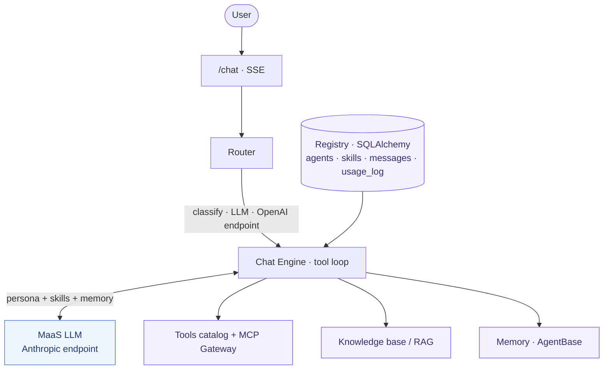
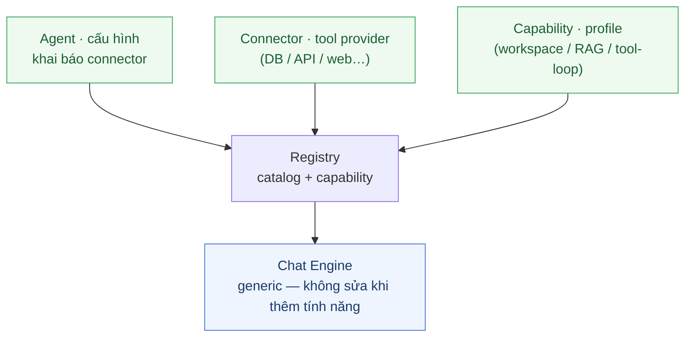

<div align="center">

# 🐾 Cục Cưng

### _Có việc gì khó, để Cục Cưng lo._

**Nền tảng agent cho tổ chức — nơi mỗi người tự tạo trợ lý riêng bằng lời nói,<br>rồi lan tỏa thành tri thức chung của cả tổ chức.**

[](https://www.python.org/)
[](https://greennode.ai/)
[](#)

**Khởi tạo → Trải nghiệm → Lan tỏa**

[Insight](#-insight--hành-trình-ba-bước) · [Tính năng](#-tính-năng-chính) · [Kiến trúc](#-kiến-trúc) · [Quickstart](#-quickstart-local) · [Deploy](#-deploy-trên-greennode-agentbase) · [Demo](#-demo--dùng-thử)

</div>

> [!NOTE]
> Sản phẩm dự thi **GreenNode Claw-a-thon 2026** — xây dựng hoàn toàn trên **GreenNode AgentBase** (MaaS · Memory · MCP Gateway · Custom Agent runtime).

<!-- TODO: chèn link video demo 2–3 phút + ảnh GIF luồng tạo agent ở đây -->

---

## ✨ Insight — Hành trình ba bước

Với **Cục Cưng – Agent Platform**, có hai cách approach để tạo agent:

- **No-code** — trò chuyện với **Master Agent**, đi từ **Khởi tạo → Trải nghiệm → Lan tỏa**, để kinh nghiệm của mỗi người dần trở thành tri thức chung của cả tổ chức.

- **Pro-code** — khai báo **connector** hoặc **capability** theo kiến trúc **plug-and-play**, giúp mở rộng khả năng của nền tảng mà không cần chỉnh sửa engine.

|      | Bước              | Cam kết                                                 | Điều thực sự diễn ra |
| :--: | ----------------- | ------------------------------------------------------- | ---------------------- |
| **01** | **Khởi tạo**   | _Mô tả nhu cầu bằng lời. Cục Cưng lo phần còn lại._   | Master Agent phỏng vấn, tạo *skill* chuẩn hóa và sinh *agent con* sẵn sàng dùng — không cần code, không cần cấu hình. |
| **02** | **Trải nghiệm** | _Dùng trong công việc thực. Tinh chỉnh qua hội thoại._ | Agent là bản draft của riêng bạn — áp dụng vào việc thật, phản hồi để Cục Cưng điều chỉnh skill và persona. |
| **03** | **Lan tỏa**    | _Từ kinh nghiệm cá nhân. Thành tri thức tập thể._     | Submit để phê duyệt. Qua governance (maker-checker), agent chuyển `active` — cả tổ chức gọi được theo tên hoặc mô tả ý định. |

### Vấn đề được giải quyết

- 🧩 **Kiến thức phân tán** — nghiệp vụ nằm rải rác trong prompt cá nhân của mỗi người.
- 🚧 **Rào cản kỹ thuật** — người không rành lập trình không thể tự dựng agent.
- 🔍 **Thiếu quản trị** — không ai biết ai tạo gì, chất lượng ra sao, có thể dùng lại không.

> Lời giải: **đóng gói tri thức thành skill chuẩn hóa**, lưu trong registry tập trung, tái sử dụng và kiểm soát chất lượng được — thay vì để tri thức nằm phân tán.

### 🔌 Dành cho kỹ sư — Plug-and-play (pro-code)

Ngoài hành trình 3 bước cho mọi người, nền tảng mở thêm con đường cho kỹ sư muốn xây agent chuyên sâu hơn:

|                | 🟢 **Guided** (no-code)                            | 🔵 **Plug-and-play** (pro-code) |
| -------------- | --------------------------------------------------- | -------------------------------- |
| **Dành cho**   | Mọi người, không cần lập trình                      | Lập trình viên, kỹ sư tích hợp |
| **Cách làm**   | Đi qua hành trình 3 bước với Master Agent           | Viết một **connector** (tool dạng MCP) vào catalog; agent khai báo `connectors=[...]` là dùng được ngay |
| **Kết quả**    | Persona + skill (quy trình nghiệp vụ chuẩn hóa)   | Truy vấn DB, gọi API nội bộ, web search, sinh code… |
| **Ranh giới**  | Master chọn trong những skill/connector đã có, không tự sinh code | Code connector do dev kiểm soát, review trước khi vào catalog |

Triết lý: **thêm tính năng = khai báo, không sửa engine**. Engine là code generic; mọi tính năng mới được gắn vào qua **cờ/field declarative**. Chi tiết: [`CONTRIBUTING.md`](CONTRIBUTING.md).

> [!TIP]
> **Upia** là ví dụ điển hình — agent nhận mô tả tích hợp đối tác → phân tích → scaffold → sinh source code → đóng gói ZIP bàn giao. Dev mở rộng **một lần**, nghiệp vụ tái sử dụng **nhiều lần**.

---

## 🚀 Tính năng chính

|       | Tính năng                        | Mô tả |
| :---: | -------------------------------- | ----- |
| 🧠    | **Master Agent**                 | Phỏng vấn, tạo skill chuẩn hóa và sinh agent con qua 8 công cụ quản trị. |
| ⚡    | **Agent con virtual**            | Một dòng config trong registry, chạy chung engine — tạo tức thì, không cần deploy riêng. |
| 🔌    | **Connector plug-and-play**      | Dev đăng ký tool provider (dạng MCP); agent khai báo `connectors=[...]` là dùng được ngay. |
| 🧭    | **Routing 3 tầng**               | Theo tên agent → `@mention` → classify bằng LLM → fallback về Master. |
| ✅    | **Governance maker-checker**     | Vòng đời `draft → pending_review → active / rejected`; chỉ `active` mới hiển thị cho toàn tổ chức. |
| 🔁    | **Skill lifecycle & versioning** | Sửa skill `active` ghi vào `pending_changes`; admin duyệt mới tăng version, toàn bộ agent liên quan được cập nhật. |
| 💾    | **Memory cloud**                 | Lưu lịch sử hội thoại qua module Memory của AgentBase (fallback SQLite local). |
| 🌐    | **MCP Gateway**                  | Web search đi qua MCP Gateway của AgentBase. |
| 📎    | **Upload & Knowledge base**      | Đính kèm tài liệu PDF, DOCX, CSV, Excel vào knowledge base. |
| 🛠️   | **Upia (agent showcase)**        | Phân tích → scaffold → implement → đóng gói file ZIP bàn giao. |

---

## 🏛️ Kiến trúc



<details>
<summary><b>📊 4 luồng chính</b> (bấm để mở rộng)</summary>

<br>

| Flow | Mô tả |
| ---- | ----- |
| **1 — Routing**          | Có tên agent → dùng trực tiếp; `@mention` → match; còn lại → classify JSON → về Master nếu null/thấp. |
| **2 — Master tạo agent** | `list_agents/skills` → phỏng vấn → `create_skill` → `create_agent` → `attach_skill` → `submit_for_review`. Validate: tên duy nhất, prompt ≥ 200 ký tự, không chứa secret. |
| **3 — Chat**             | Load config → system prompt = persona + skills + memories → lịch sử 20 tin → MaaS stream → tool loop (tối đa 5 vòng) → ghi memory + usage_log. |
| **4 — Skill lifecycle**  | Sửa skill `active` → `pending_changes` → admin duyệt → version +1 → toàn bộ agent liên quan cập nhật. |

</details>

### 🔌 Kiến trúc plug-and-play

Engine là **code generic — đóng với việc sửa, mở với mở rộng**: thêm tính năng mới chỉ là **khai báo declarative**, engine nhận biết qua **cờ/field** chứ không qua nhánh điều kiện theo tên agent.



- **Agent** — khai báo persona + danh sách connector, không cần code.
- **Connector** — đăng ký tool provider (truy vấn DB, gọi API nội bộ, web search…); agent gọi tên là dùng được.
- **Capability** — khai báo profile nâng cao (workspace ghi file & đóng gói, RAG theo cuộc, tuỳ chỉnh tool-loop). Registry quyết định ẩn/lộ tool; engine giữ nguyên.

> Nếu thêm agent/connector mà **buộc phải sửa engine**, đó là tín hiệu thiếu một cờ/field declarative. Quy ước đầy đủ: [`CONTRIBUTING.md`](CONTRIBUTING.md).

**Tech stack:** `FastAPI` · `SQLAlchemy 2.0 + Alembic` · `Anthropic SDK` (qua GreenNode MaaS) · `OpenAI SDK` (router classify) · `Pydantic v2` · `SQLite / PostgreSQL`

---

## ⚙️ Quickstart (local)

> **Yêu cầu:** Python 3.12+ · API key GreenNode MaaS

```bash
# 1. Cấu hình
cp .env.example .env        # điền GREENNODE_CLIENT_ID / SECRET / MAAS_API_KEY

# 2a. Chạy dev
uvicorn app.main:app --reload --port 8000

# 2b. Hoặc Docker
docker-compose up           # truy cập http://localhost:8000

# 3. Chạy test
pip install -e ".[dev]"
pytest                      # 52 test cần pass trước khi deploy
```

App tự động chạy `alembic upgrade` và seed dữ liệu demo (Master + agent `ThamDinhHopDong`) khi DB rỗng.

UI e2e (Playwright): `pip install -e ".[e2e]" && playwright install chromium && pytest e2e/` — xem [`e2e/README.md`](e2e/README.md).

---

## 🔐 Cấu hình môi trường

| Biến | Ý nghĩa |
| ---- | ------- |
| `GREENNODE_CLIENT_ID` / `GREENNODE_CLIENT_SECRET` | IAM client credentials (portal GreenNode → IAM / Service Account). |
| `MAAS_API_KEY`            | API key MaaS (dùng chung cho cả hai endpoint). |
| `MAAS_BASE_URL`           | Endpoint MaaS, mặc định `https://maas-llm-aiplatform-hcm.api.vngcloud.vn`. |
| `MODEL`                   | Model chính (ví dụ: `minimax/minimax-m2.5`). Để trống lấy model đầu pool. |
| `ROUTER_MODEL`            | Model phân loại (ví dụ: `qwen/qwen3-5-27b`), gọi qua OpenAI-compatible endpoint (`/v1`). |
| `MEMORY_BACKEND`          | `agentbase` để dùng Memory cloud; để trống fallback về SQLite local. |
| `AGENTBASE_MEMORY_STORE_ID` / `..._STRATEGY_ID` | ID store/strategy khi bật memory cloud. |
| `MCP_GATEWAY_ENDPOINT`    | URL MCP Gateway — set sau khi deploy để dùng web search qua gateway. |
| `DATABASE_URL`            | `sqlite:///...` (mặc định) hoặc `postgresql://...` cho production. |
| `BUILDER_ENABLED`         | Bật/tắt bộ công cụ quản trị của Master. |
| `UPIA_EXPERIMENTAL_MODE`  | `true` = Upia chạy đến hết Phase 3 rồi đóng gói ZIP (bỏ bước mô phỏng). |

> [!WARNING]
> **Lưu ý MaaS:** endpoint Anthropic **không** phục vụ một số model (`gpt-4o-mini`, `gemini-flash-lite` → 404). Router **luôn** đi qua OpenAI endpoint. SDK `anthropic` dùng `auth_token=` (Bearer), không phải `api_key=`.

---

## ☁️ Deploy trên GreenNode AgentBase

> **Runtime contract:** container lắng nghe **port 8080**, expose `GET /health → 200` (đã cấu hình trong `Dockerfile`).

```bash
# KHÔNG bake credential vào image — inject toàn bộ env khi deploy.
docker build -t <registry>/agent-hub:latest .
docker push <registry>/agent-hub:latest
```

**Sau khi deploy, bật MCP Gateway:**

1. PATCH target của gateway `agent-hub-gw` về `{deployed_app_url}/mcp`.
2. Set `MCP_GATEWAY_ENDPOINT=https://gw-agent-hub-gw-111745.agentbase-gateway.aiplatform.vngcloud.vn` trong env container.

Cấu hình Google OAuth: xem [`DEPLOY_GOOGLE_OAUTH.md`](draft/DEPLOY_GOOGLE_OAUTH.md).

> [!IMPORTANT]
> Production nên set `DATABASE_URL=postgresql://...` — SQLite trong container là ephemeral nếu không mount volume.

---

## 📂 Cấu trúc thư mục

```
app/
  main.py            — composition root: wire impl theo env, alembic upgrade, seed
  config.py          — pydantic-settings (có fallback cho env trống)
  core/              — models, router, chat_engine, governance, prompts
  builder/           — master.py (8 tool quản trị) + master_system.md (prompt nguồn)
  agents/upia/       — agent showcase sinh code tích hợp đối tác
  llm/               — anthropic_client (Plan A) + openai_client (router)
  storage/sql.py     — SQLAlchemy 2.0, 5 bảng
  memory/            — sql_memory (fallback) + agentbase_memory (cloud)
  knowledge/         — knowledge base (PDF / DOCX / CSV / Excel)
  tools/             — catalog, mock MCP servers, mcp_gateway, file_export
  api/               — chat (SSE), review, agents, skills, upload, knowledge, …
  auth/middleware.py — X-User-Id (production swap OIDC/SSO)
web/                 — UI: Chat SSE + user switcher + Catalog + Review
migrations/          — alembic (tự upgrade khi khởi động)
seeds/demo_data.py   — seed Master + ThamDinhHopDong khi DB rỗng
tests/ · e2e/ · evals/
```

---

## 🎬 Demo / Dùng thử

Mở UI, dùng **user switcher** (An / Bình / Admin) để trải nghiệm góc nhìn maker vs. admin.

1. 🟢 **Khởi tạo** — *An* chat với Master: _"Tôi cần agent thẩm định hợp đồng"_ → Master phỏng vấn, tạo skill + agent con (draft, An dùng ngay).
2. 🔵 **Trải nghiệm** — An gọi agent theo tên hoặc mô tả _"thẩm định hợp đồng này"_ → router tự định tuyến (`ThamDinhHopDong / high`).
3. 🟣 **Lan tỏa** — An `submit_for_review` → *Admin* phê duyệt → agent chuyển `active`, toàn tổ chức truy cập được.
4. 🛠️ **Pro-code** — thử **Upia**: mô tả nhu cầu tích hợp đối tác → Upia sinh source code và bàn giao file ZIP ngay trong chat.

---

## 📚 Tài liệu liên quan

- [`CLAUDE.md`](CLAUDE.md) — context kỹ thuật & các quyết định thiết kế đã chốt.
- [`E2E_TEST_REPORT.md`](draft/E2E_TEST_REPORT.md) — báo cáo kiểm thử end-to-end.
- [`UIUX_REVIEW.md`](UIUX_REVIEW.md) — review UI/UX.
- [`evals/`](evals) — harness đánh giá chất lượng agent.
- [`DEPLOY_GOOGLE_OAUTH.md`](draft/DEPLOY_GOOGLE_OAUTH.md) — hướng dẫn cấu hình OAuth khi deploy public.

---

<div align="center">

Sản phẩm dự thi **GreenNode Claw-a-thon 2026** · deadline 17/06/2026
Xây dựng trên **GreenNode AgentBase** — MaaS · Memory · MCP Gateway · Custom Agent runtime

**🐾 Có việc gì khó, để Cục Cưng lo.**

</div>
