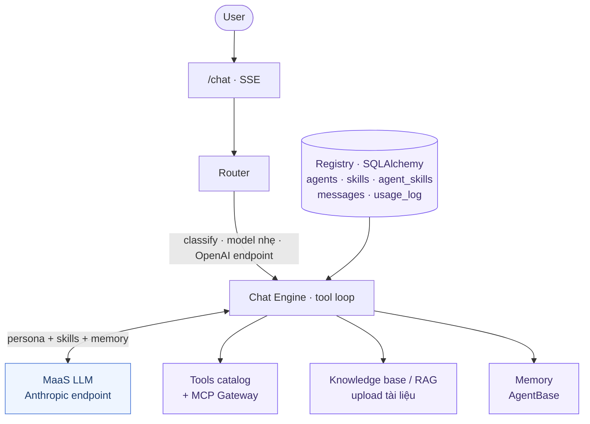
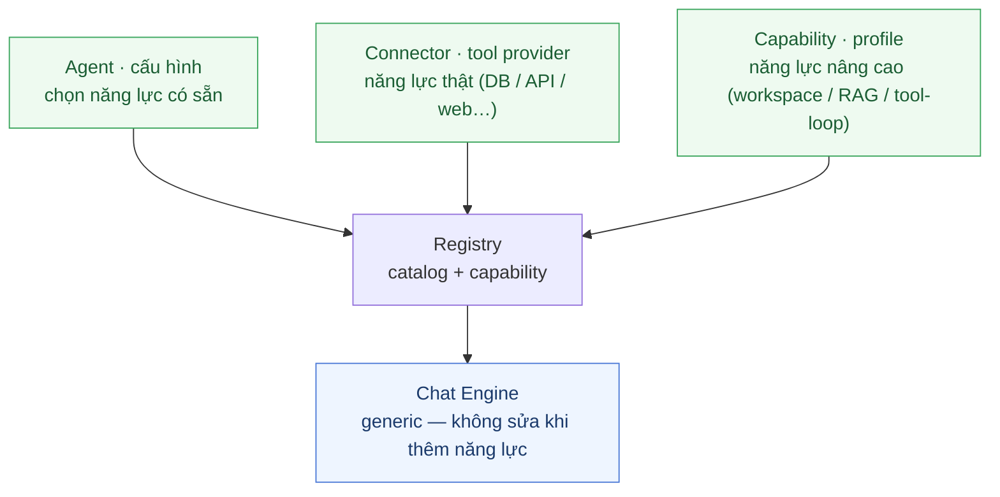

<div align="center">

# 🐾 Cục Cưng

### _Có việc gì khó, để Cục Cưng lo._

**Nền tảng agent cho tổ chức — nơi mỗi người tự tạo trợ lý riêng bằng lời nói,<br>rồi lan tỏa thành năng lực chung của cả tổ chức.**

[](https://www.python.org/)
[](https://greennode.ai/)
[](#)

**Khởi tạo → Trải nghiệm → Lan tỏa**

[Insight](#-insight--hành-trình-ba-bước) · [Tính năng](#-tính-năng-chính) · [Kiến trúc](#-kiến-trúc) · [Quickstart](#-quickstart-local) · [Deploy](#-deploy-trên-greennode-agentbase) · [Demo](#-demo--dùng-thử)

</div>

> [!NOTE]
> Sản phẩm dự thi **GreenNode Claw-a-thon 2026** — xây dựng hoàn toàn trên **GreenNode AgentBase** (MaaS · Memory · MCP Gateway · Custom Agent runtime).

<!-- TODO: chèn link video demo 2–3 phút + ảnh GIF luồng tạo agent ở đây -->

---

## ✨ Insight — Hành trình ba bước

Cục Cưng mở **hai con đường tạo agent** — **nói** để tạo (no-code, dành cho mọi người) hoặc **khai báo** để mở rộng (pro-code, dành cho kỹ sư) — cả hai cùng gắn vào một engine generic theo kiến trúc **plug-and-play**: thêm năng lực là *khai báo*, không sửa engine. Với người dùng phổ thông, nền tảng biến việc "tạo agent" thành một hành trình tự nhiên: bạn **nói** → bạn **dùng** → những gì bạn làm tốt sẽ **lan rộng ra cả tổ chức**.

```
   ┌─────────────────┐      ┌─────────────────┐      ┌─────────────────┐
   │  01 · KHỞI TẠO  │ ───▶ │ 02 · TRẢI NGHIỆM │ ───▶ │  03 · LAN TỎA   │
   ├─────────────────┤      ├─────────────────┤      ├─────────────────┤
   │ Mô tả nhu cầu   │      │ Sử dụng trong   │      │ Từ kinh nghiệm  │
   │ bằng lời nói.   │      │ công việc thực. │      │ cá nhân trở     │
   │ Cục Cưng lo     │      │ Tinh chỉnh qua  │      │ thành năng lực  │
   │ phần còn lại.   │      │ hội thoại. Hoàn │      │ tập thể.        │
   │                 │      │ thiện mỗi ngày. │      │                 │
   └─────────────────┘      └─────────────────┘      └─────────────────┘
        cá nhân                   cá nhân                  tổ chức
```

|      | Bước              | Cam kết                                                                          | Điều thực sự diễn ra                                                                                                                                                                     |
| :--: | ----------------- | -------------------------------------------------------------------------------- | ----------------------------------------------------------------------------------------------------------------------------------------------------------------------------------------- |
| **01** | **Khởi tạo**   | _Mô tả nhu cầu bằng lời. Cục Cưng lo phần còn lại._                            | Bạn diễn đạt nhu cầu bằng ngôn ngữ tự nhiên. Master Agent phỏng vấn, chưng cất thành *skill* chuẩn hóa và sinh *agent con* sẵn sàng sử dụng — không cần code, không cần cấu hình.    |
| **02** | **Trải nghiệm** | _Dùng trong công việc thực. Tinh chỉnh qua hội thoại. Hoàn thiện mỗi ngày._   | Agent là bản nháp riêng của bạn (draft). Áp dụng vào việc thật — nếu chưa ổn, phản hồi lại để Cục Cưng điều chỉnh skill và persona. Agent cải thiện theo cách bạn làm việc.         |
| **03** | **Lan tỏa**    | _Từ kinh nghiệm cá nhân. Thành năng lực tập thể._                              | Khi agent đã chín muồi, submit để phê duyệt. Qua quy trình governance (maker-checker), agent chuyển trạng thái `active` — cả tổ chức có thể gọi theo tên hoặc mô tả ý định. Tri thức của một người trở thành tài sản chung, có kiểm soát chất lượng. |

### Vấn đề được giải quyết

Mọi người trong tổ chức đều cần agent riêng cho nghiệp vụ của mình, nhưng tồn tại ba rào cản:

- 🧩 **Kiến thức phân tán** — mỗi người một cách làm, nghiệp vụ nằm rải rác trong prompt cá nhân.
- 🚧 **Rào cản kỹ thuật** — người không rành lập trình không thể tự dựng agent.
- 🔍 **Thiếu quản trị tập trung** — không ai biết ai tạo gì, chất lượng ra sao, có thể tái sử dụng không.

> Hành trình ba bước ở trên là lời giải: **đóng gói tri thức thành skill chuẩn hóa**, lưu trong registry tập trung, cho phép tái sử dụng và kiểm soát chất lượng — thay vì để tri thức nằm phân tán.

### 🔌 Con đường dành cho kỹ sư — Plug-and-play (pro-code)

Ba bước trên dành cho **mọi người**, không cần kiến thức kỹ thuật. Nền tảng còn mở thêm một con đường cho **kỹ sư muốn xây agent chuyên sâu** — theo mô hình **plug-and-play**:

|                | 🟢 **Guided** (no-code)                                          | 🔵 **Plug-and-play** (pro-code)                                                                                          |
| -------------- | ---------------------------------------------------------------- | ------------------------------------------------------------------------------------------------------------------------ |
| **Dành cho**   | Mọi người, không yêu cầu kỹ năng lập trình                      | Lập trình viên, kỹ sư tích hợp                                                                                           |
| **Cách làm**   | Đi qua hành trình 3 bước, tương tác trực tiếp với Master Agent  | Viết một **connector** (tool dạng MCP) vào catalog; agent chỉ cần khai báo `connectors=[...]` là tích hợp được năng lực mới |
| **Kết quả**    | Persona + skill (quy trình nghiệp vụ được chuẩn hóa)            | Năng lực thực: truy vấn DB, gọi API nội bộ, web search, sinh code…                                                      |
| **Ranh giới**  | Master **chọn** skill/connector có sẵn, **không tự sinh code**  | Code connector do dev kiểm soát, được review trước khi đưa vào catalog                                                  |

Triết lý của con đường này: **thêm năng lực = khai báo, không sửa engine**. Engine (`app/core/chat_engine.py`) là code generic; mọi năng lực mới được gắn vào qua **cờ/field declarative** thay vì nhánh `if` theo tên agent. Có ba mức đóng góp — chi tiết trong [`CONTRIBUTING.md`](CONTRIBUTING.md):

| Loại | Bạn viết gì | Đụng file nào | Sửa engine? |
| ---- | ----------- | ------------- | :---------: |
| **1 · Agent mới** | Persona + skill + danh sách connector có sẵn | `seeds/demo_data.py` (hoặc qua Master UI) | Không |
| **2 · Connector mới** | Một `ToolProvider` (tool dạng MCP) | `app/tools/<ten>.py` + 1 dòng wire ở `app/main.py` | Không |
| **3 · Agent nâng cao** | Khai báo 1 profile năng lực (workspace/ZIP, RAG theo cuộc, tuỳ chỉnh tool-loop) | seed + 1 entry `app/core/capabilities.py` | Không |

> [!TIP]
> **Upia** là minh chứng điển hình cho Loại 3 — một agent chuyên sâu nhận mô tả tích hợp đối tác → phân tích → scaffold → sinh source code → đóng gói project thành file ZIP để bàn giao. Năng lực đặc biệt (workspace ghi file, đóng gói ZIP) trước đây hard-code theo tên agent trong engine; nay **khai báo declarative** qua capability registry. Dev mở rộng năng lực nền **một lần**, người dùng nghiệp vụ tái sử dụng **nhiều lần** qua hành trình 3 bước. Đó là tinh thần plug-and-play.

---

## 🚀 Tính năng chính

|       | Tính năng                        | Mô tả                                                                                                                              |
| :---: | -------------------------------- | ---------------------------------------------------------------------------------------------------------------------------------- |
| 🧠    | **Master Agent**                 | Phỏng vấn người dùng, chưng cất nhu cầu thành skill markdown chuẩn hóa, tạo agent con thông qua 8 công cụ quản trị.              |
| ⚡    | **Agent con virtual**            | Chỉ là một dòng config trong registry, chạy chung engine của Hub — tạo tức thì, không cần deploy runtime riêng.                   |
| 🔌    | **Connector plug-and-play**      | Dev đăng ký một tool provider (dạng MCP) vào catalog; agent khai báo `connectors=[...]` là sẵn sàng sử dụng ngay.                |
| 🧭    | **Routing 3 tầng**               | Ưu tiên theo tên agent → `@mention` → phân loại bằng LLM (model nhẹ) → fallback về Master.                                       |
| ✅    | **Governance maker-checker**     | Vòng đời `draft → pending_review → active / rejected`; draft dùng được ngay, chỉ `active` mới hiển thị cho toàn tổ chức.         |
| 🔁    | **Skill lifecycle & versioning** | Sửa skill đang `active` ghi vào `pending_changes` (bản active vẫn tiếp tục chạy); admin phê duyệt mới tăng version, toàn bộ agent gắn với skill đó được cập nhật đồng thời. |
| 💾    | **Memory cloud**                 | Lưu lịch sử hội thoại qua module Memory của AgentBase (fallback SQLite local).                                                    |
| 🌐    | **MCP Gateway**                  | Công cụ web search đi qua MCP Gateway của AgentBase.                                                                              |
| 📎    | **Upload & Knowledge base**      | Đính kèm và đưa vào knowledge base các tài liệu PDF, DOCX, CSV, Excel.                                                            |
| 🛠️   | **Upia (agent showcase)**        | Agent sinh code tích hợp đối tác: phân tích → scaffold → implement → đóng gói file ZIP để bàn giao.                              |

---

## 🏛️ Kiến trúc



<details>
<summary><b>📊 4 luồng chính</b> (bấm để mở rộng)</summary>

<br>

| Flow | Mô tả |
| ---- | ----- |
| **1 — Routing**             | Có tên agent → dùng trực tiếp; có `@mention` → match; còn lại → classify JSON (model nhẹ qua OpenAI endpoint) → về Master nếu kết quả null hoặc độ tin cậy thấp. |
| **2 — Master tạo agent**    | Tool loop: `list_agents/skills` → phỏng vấn người dùng → `create_skill` → `create_agent` → `attach_skill` → `submit_for_review`. App validate: tên duy nhất, prompt ≥ 200 ký tự, không chứa secret, dedup. |
| **3 — Chat**                | Tải config agent → system prompt = persona + skills + memories → lịch sử 20 tin gần nhất → MaaS stream → tool loop (tối đa 5 vòng) → ghi memory + usage_log. |
| **4 — Skill lifecycle**     | Sửa skill `active` → ghi `pending_changes` → admin phê duyệt → version +1 → toàn bộ agent gắn với skill đó được cập nhật. |

</details>

### 🔌 Kiến trúc plug-and-play

Engine là **code generic — đóng với việc sửa, mở với mở rộng**: thêm năng lực mới chỉ là **khai báo declarative**, engine nhận biết qua **cờ/field** chứ không qua nhánh điều kiện theo tên agent. Ba điểm mở rộng độc lập, gắn vào engine qua một tầng registry chung:



- **Agent** — khai báo persona + danh sách connector có sẵn, không cần code.
- **Connector** — đăng ký một tool provider để có năng lực thật (truy vấn DB, gọi API nội bộ, web search…); agent chỉ cần gọi tên là dùng được.
- **Capability** — khai báo một profile năng lực nâng cao (workspace ghi file & đóng gói, RAG theo cuộc, tuỳ chỉnh tool-loop). Registry quyết định ẩn/lộ tool và chế độ chạy; engine giữ nguyên.

> Nguyên tắc: nếu thêm một agent/connector mà **buộc phải sửa engine**, đó là tín hiệu thiếu một cờ/field declarative. Quy ước và checklist đầy đủ cho người đóng góp: [`CONTRIBUTING.md`](CONTRIBUTING.md).

**Tech stack:** `FastAPI` · `SQLAlchemy 2.0 + Alembic` · `Anthropic SDK` (qua GreenNode MaaS) · `OpenAI SDK` (router classify) · `Pydantic v2` · `SQLite / PostgreSQL`

---

## ⚙️ Quickstart (local)

> **Yêu cầu:** Python 3.12+ · API key GreenNode MaaS

```bash
# 1. Cấu hình
cp .env.example .env        # điền GREENNODE_CLIENT_ID / SECRET / MAAS_API_KEY

# 2a. Chạy dev
uvicorn app.main:app --reload --port 8000

# 2b. Hoặc Docker
docker-compose up           # truy cập http://localhost:8000

# 3. Chạy test
pip install -e ".[dev]"
pytest                      # 52 test cần pass trước khi deploy
```

App tự động chạy `alembic upgrade` và seed dữ liệu demo (Master + agent `ThamDinhHopDong`) khi DB rỗng.

UI e2e (Playwright) chạy tách biệt: `pip install -e ".[e2e]" && playwright install chromium && pytest e2e/` — xem [`e2e/README.md`](e2e/README.md).

---

## 🔐 Cấu hình môi trường

| Biến | Ý nghĩa |
| ---- | ------- |
| `GREENNODE_CLIENT_ID` / `GREENNODE_CLIENT_SECRET` | IAM client credentials (portal GreenNode → IAM / Service Account). |
| `MAAS_API_KEY`            | API key MaaS (dùng chung cho cả hai endpoint).                                                                   |
| `MAAS_BASE_URL`           | Endpoint MaaS, mặc định `https://maas-llm-aiplatform-hcm.api.vngcloud.vn`.                                      |
| `MODEL`                   | Model chính (ví dụ: `minimax/minimax-m2.5`). Để trống sẽ lấy model đầu tiên trong pool.                        |
| `ROUTER_MODEL`            | Model phân loại (ví dụ: `qwen/qwen3-5-27b`), gọi qua **OpenAI-compatible endpoint** (`/v1`).                   |
| `MEMORY_BACKEND`          | `agentbase` để dùng Memory cloud; để trống sẽ fallback về SQLite local.                                         |
| `AGENTBASE_MEMORY_STORE_ID` / `..._STRATEGY_ID` | ID store/strategy khi bật memory cloud.                                              |
| `MCP_GATEWAY_ENDPOINT`    | URL MCP Gateway — cấu hình sau khi deploy để dùng web search qua gateway.                                       |
| `DATABASE_URL`            | `sqlite:///...` (mặc định) hoặc `postgresql://...` cho môi trường production.                                   |
| `BUILDER_ENABLED`         | Bật/tắt bộ công cụ quản trị của Master.                                                                         |
| `UPIA_EXPERIMENTAL_MODE`  | `true` = Upia chạy đến hết Phase 3 rồi đóng gói ZIP (bỏ qua bước mô phỏng).                                   |

> [!WARNING]
> **Lưu ý về MaaS:** endpoint Anthropic **không** phục vụ một số model (`gpt-4o-mini`, `gemini-flash-lite` → trả về 404). Router **luôn** đi qua OpenAI endpoint. SDK `anthropic` sử dụng `auth_token=` (Bearer), không phải `api_key=`.

---

## ☁️ Deploy trên GreenNode AgentBase

> **Runtime contract:** container lắng nghe trên **port 8080**, expose `GET /health → 200` (đã cấu hình sẵn trong `Dockerfile`).

```bash
# Build và push image lên Container Registry, sau đó tạo Custom Agent từ image đó.
# KHÔNG bake credential vào image — inject toàn bộ env khi deploy.
docker build -t <registry>/agent-hub:latest .
docker push <registry>/agent-hub:latest
```

**Sau khi deploy, thực hiện 2 bước để bật MCP Gateway:**

1. PATCH target của gateway `agent-hub-gw` về `{deployed_app_url}/mcp`.
2. Set `MCP_GATEWAY_ENDPOINT=https://gw-agent-hub-gw-111745.agentbase-gateway.aiplatform.vngcloud.vn` trong env của container → app tự động dùng gateway thay vì web search local.

Cấu hình Google OAuth khi deploy public: xem [`DEPLOY_GOOGLE_OAUTH.md`](DEPLOY_GOOGLE_OAUTH.md).

> [!IMPORTANT]
> Môi trường production nên set `DATABASE_URL=postgresql://...` — SQLite trong container là ephemeral nếu không mount volume.

---

## 📂 Cấu trúc thư mục

```
app/
  main.py            — composition root: wire impl theo env, alembic upgrade, seed
  config.py          — pydantic-settings (có fallback cho env trống)
  core/              — models, router, chat_engine, governance, prompts
  builder/           — master.py (8 tool quản trị) + master_system.md (prompt nguồn)
  agents/upia/       — agent showcase sinh code tích hợp đối tác
  llm/               — anthropic_client (Plan A) + openai_client (router)
  storage/sql.py     — SQLAlchemy 2.0, 5 bảng
  memory/            — sql_memory (fallback) + agentbase_memory (cloud)
  knowledge/         — knowledge base (PDF / DOCX / CSV / Excel)
  tools/             — catalog, mock MCP servers, mcp_gateway, file_export
  api/               — chat (SSE), review, agents, skills, upload, knowledge, …
  auth/middleware.py — X-User-Id (production swap OIDC/SSO)
web/                 — UI: Chat SSE + user switcher + Catalog + Review
migrations/          — alembic (tự upgrade khi khởi động)
seeds/demo_data.py   — seed Master + ThamDinhHopDong khi DB rỗng
tests/ · e2e/ · evals/
```

---

## 🎬 Demo / Dùng thử

Mở UI, dùng **user switcher** (An / Bình / Admin) để trải nghiệm góc nhìn maker vs. admin.

**Kịch bản gợi ý — đi trọn hành trình 3 bước:**

1. 🟢 **Khởi tạo** — *An* chat với Master: _"Tôi cần một agent thẩm định hợp đồng"_ → Master phỏng vấn, tạo skill + agent con (draft, An dùng được ngay).
2. 🔵 **Trải nghiệm** — An gọi lại agent đó theo tên hoặc chỉ mô tả _"thẩm định hợp đồng này"_ → router tự định tuyến (`ThamDinhHopDong / high`).
3. 🟣 **Lan tỏa** — An `submit_for_review` → *Admin* vào tab Review phê duyệt → agent chuyển trạng thái `active`, toàn tổ chức có thể truy cập.
4. 🛠️ **Pro-code** — thử **Upia**: mô tả nhu cầu tích hợp đối tác → Upia sinh source code và bàn giao file ZIP ngay trong chat.

---

## 📚 Tài liệu liên quan

- [`CLAUDE.md`](CLAUDE.md) — context kỹ thuật & các quyết định thiết kế đã được chốt.
- [`E2E_TEST_REPORT.md`](E2E_TEST_REPORT.md) — báo cáo kiểm thử end-to-end.
- [`UIUX_REVIEW.md`](UIUX_REVIEW.md) — review UI/UX.
- [`evals/`](evals) — harness đánh giá chất lượng agent.
- [`DEPLOY_GOOGLE_OAUTH.md`](DEPLOY_GOOGLE_OAUTH.md) — hướng dẫn cấu hình OAuth khi deploy public.

---

<div align="center">

Sản phẩm dự thi **GreenNode Claw-a-thon 2026** · deadline 17/06/2026
Xây dựng trên **GreenNode AgentBase** — MaaS · Memory · MCP Gateway · Custom Agent runtime

**🐾 Có việc gì khó, để Cục Cưng lo.**

</div>
